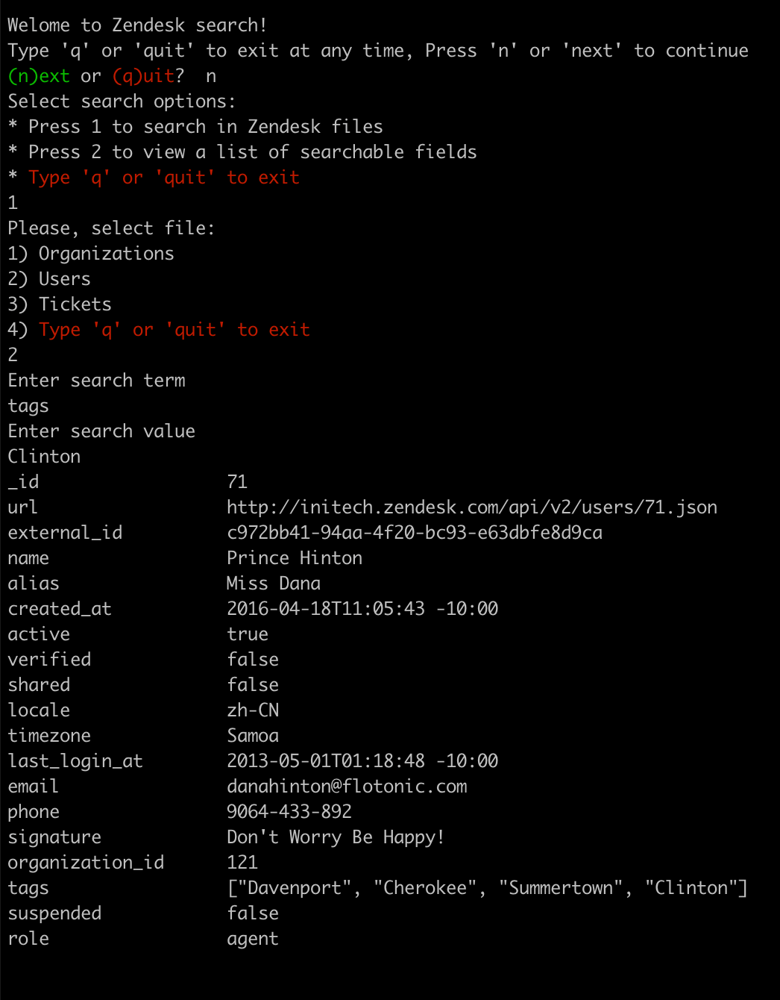
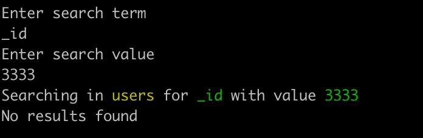

To run the program:

* run `bundle install`
* run `./bin/search`

This is a simple command-line application. It searches through files in `./data` directory. If you add any additional files in this directory it will update the list of files automatically

Each step has the option to quit the program.

## Step 1
Greeting a user. The user has a choice between 'next' and 'quit'. If a provided input doesn't meet the expectations theuser sees warning message `You must choose one of [next, quit]`. 

## Step 2
The user has choices: 1 - start search in files or 2 - see a list of searchable fields. This step also has validation. The user sees a warning message with current options. 

## Step 3
- a. If the user chooses to start searching in files, the user should see a list of filenames with numerical indices for each of them. 
- b. If the user chooses to look at searchable fields, the user should see list of fields with the title of the file on top. Then the user would be asked to continue or quit the program. 

## Step 4
(for search in files only!) Now our application knows where to look. The user will be asked to input `search_term` and `search_value`. The search only works if the term matches exactly the value. In case there were no value matching the user sees a message `No results found` and an additional information about search params (for example, `Searching in users for _id with value 3333`). 

The application is able to search within the 'tags' attribute too. For example, one would like to find Tickets with tag `Washington`. 

## Screenshots examples

